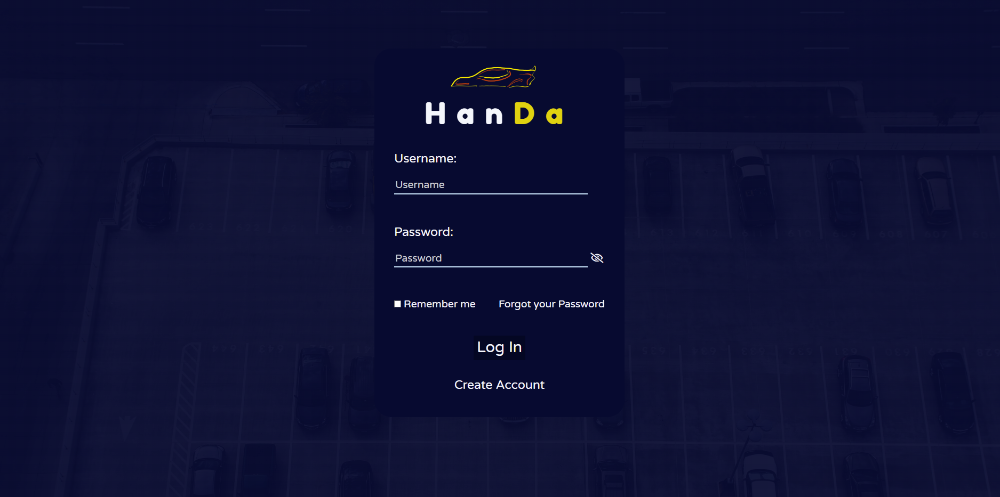
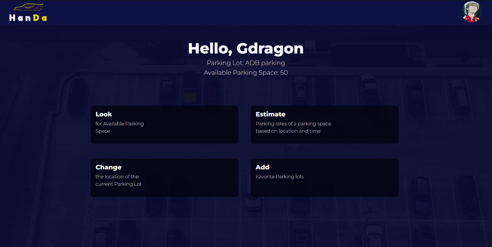
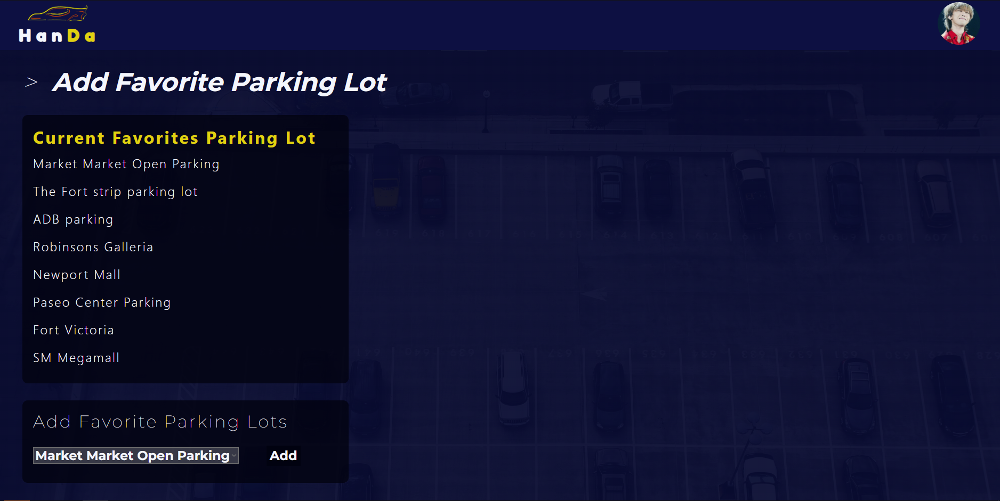
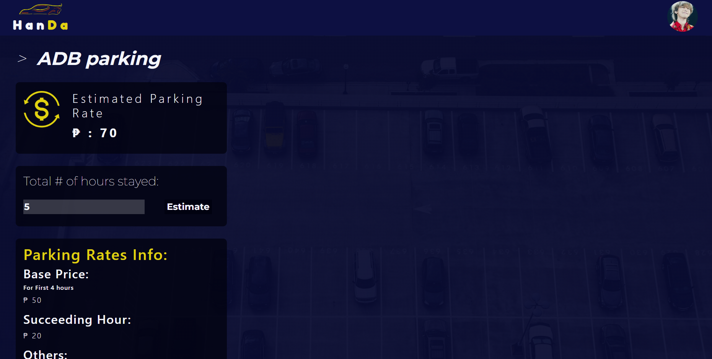

# A Prototype Parking-Finder-Web-App
**Name:** HAN-ap para-DA

**Description:** A Prototype Parking Finder Web app

**For:** SHS PR2 Finals Project for APC

# Project:
## Screengrabs with designated features

### Able to Log in with username and password

### Able to Sign up with username and password

### Able to Sign Up by inserting username, password, email, and optional image url

### Able to add favorite parking lots 

### Able to change current parking lot

### Able to estimate parking rate by the rates per hour of the current parking lot 

### No Look Parking Lot yet as computer vision is not yet implemented 

